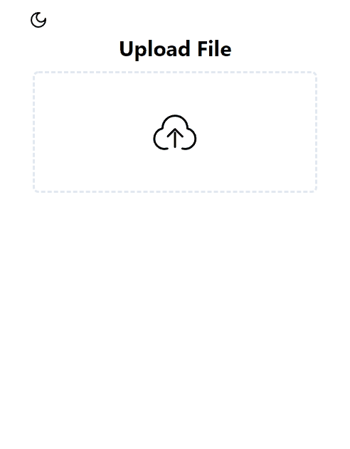
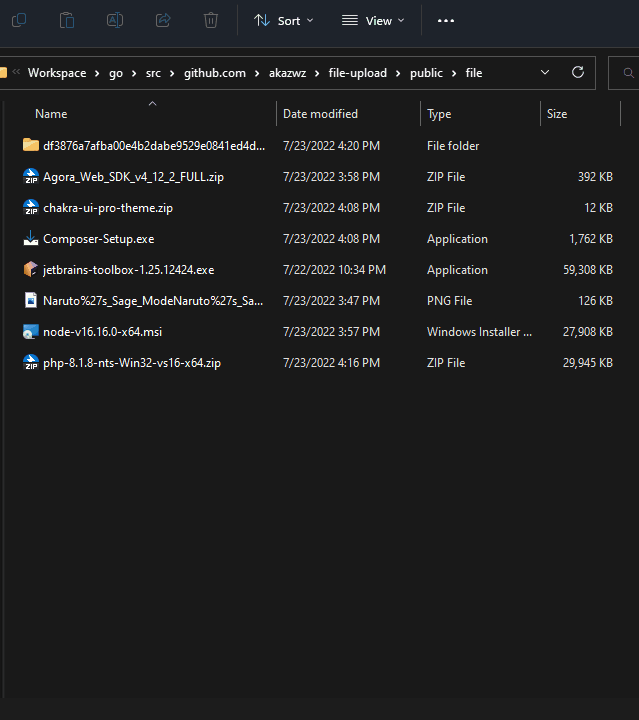

# File Upload

# 前端 为 next.js + react + ts 实现， 地址为： [file-upload-react](https://github.com/akazwz/file-upload-react)

# 实现了以下功能

1. 文件秒传
2. 断电续传
3. 计算大文件hash
4. 分块上传
5. 文件直传
6. 根据文件大小选择直传或者分块上传
7. 拖拽上传
8. 上传进度显示

# 关于文件上传的记录

## 怎么秒传

要想实现文件秒传，一般是通过在客户端获取文件的hash值， 然后通过对比服务端是否存在相同的hash值的文件实现秒传。

## 怎么计算大文件 hash

文件过大，直接计算文件hash的话浏览器会直接卡死，
所以要进行对文件进行分块计算hash，然后求和得到文件和hash。 大体思路就是文件分片然后利用promise保证顺序。

## 怎么分块上传

要想进行分块上传，需要先定义分块大小， 求出文件分块个数， 然后 循环进行上传，
要加上 index 参数，保证服务端能获取正确的分块文件的顺序。
服务端可以创建一个名为文件 hash的文件夹，然后所有的分块文件都存到这个文件夹下。

## 怎么合并文件

当我们的所有分块文件都上传到服务端后，
可以发起一个 文件合并请求，服务端确定所有分块上传完毕之后， 按照分块文件 index 的顺序读取写入到完整的文件中。
也可以服务端获取到全部分块文件后自动合并，无需请求合并接口

## 怎么断点续传

在文件上传之前，可以发起一个获取文件上传状态的请求， 该接口通过文件 hash返回上传的状态，
如是否上传成功，上传了多少分块文件以及他们的 index, 客户端获取到已经上传的文件下标后，
分片上传的时候可以直接跳过已经上传的分片。这样就可以实现断点续传

# 其他思考

## 大文件 hash计算过慢

可以进行抽样检测文件 hash， 比如抽取文件头部，中部和尾部计算hash然后求和，然后服务端也采取相同的抽样进行hash,
这样的话牺牲微小的准确率缺可以换来超快的速度。编程中很多都是要取舍的，
比如大文件hash计算，分片全量计算的话肯定慢，不分片的话内存不够，这就是时间换空间。

## 分块文件上传同时只发起一个请求太慢

可以创建请求池之类的进行解决

# 项目截图

